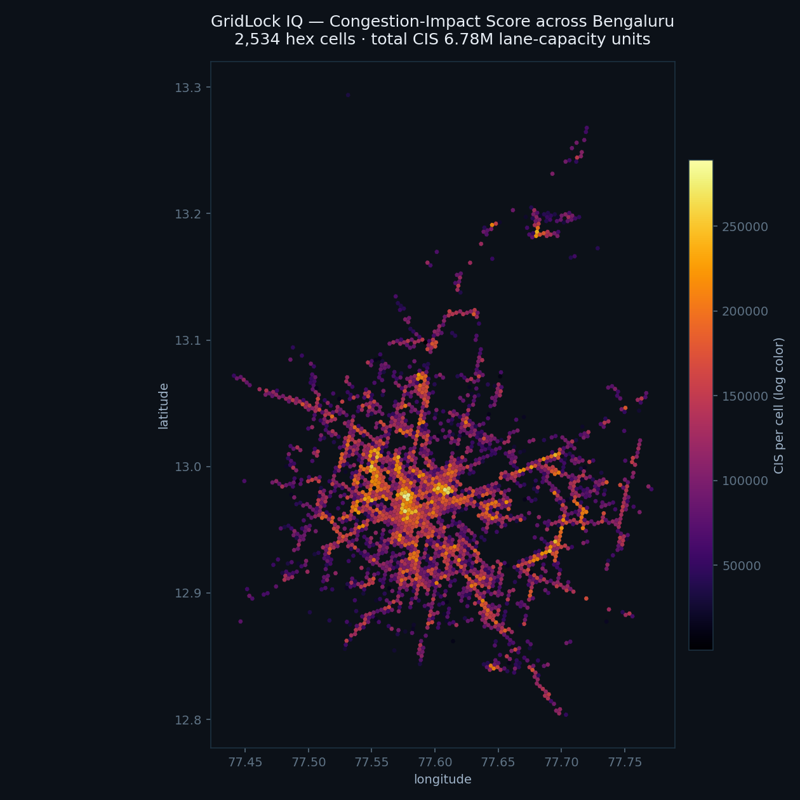
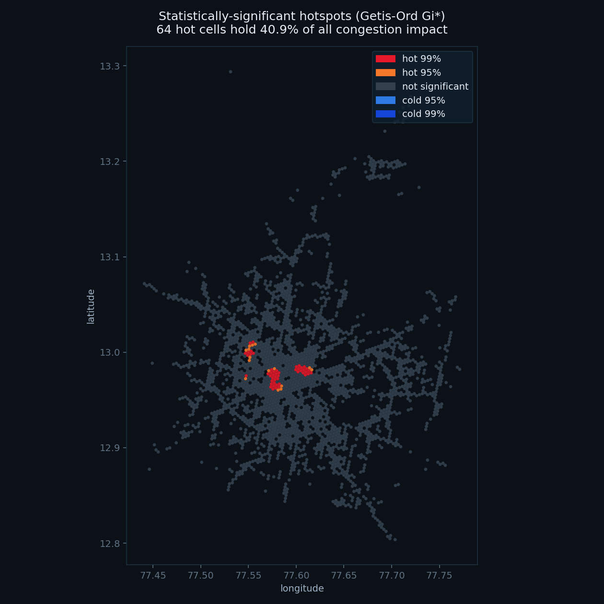
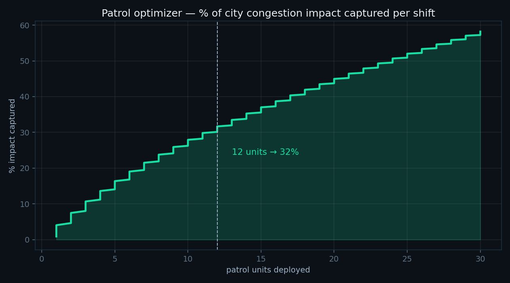
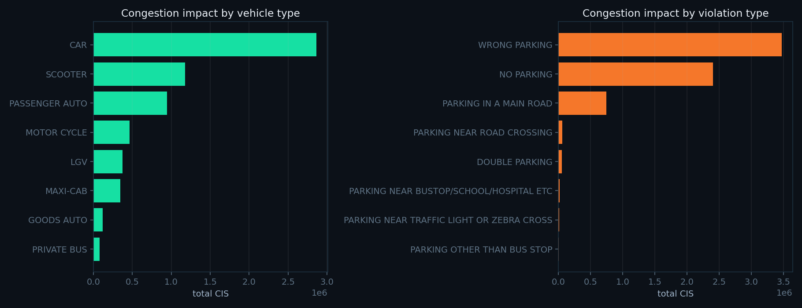

# 🚦 GridLock IQ — Parking-Induced Congestion Intelligence

**Flipkart GRiD · ML track** · *Bengaluru Traffic Police parking-enforcement data*

### 🔴 Live demo: **https://gridlock-iq.netlify.app** &nbsp;·&nbsp; [Analyst dashboard](https://gridlock-iq.netlify.app/analyst.html)
*Both dashboards + live in-browser YOLOv8 detection — runs with no backend.*

> **Problem:** On-street illegal & spillover parking chokes carriageways and junctions.
> Enforcement is patrol-based and reactive, there's no map of *violations vs. congestion
> impact*, and no way to prioritize where to send limited marshals.
>
> **GridLock IQ** turns 298,450 raw enforcement tickets into a decision system that
> **measures → predicts → acts → designs out → prices** parking-induced congestion.

---

## The one idea that wins

Every other team will build a *violation heatmap*. A heatmap shows where tickets were
written — it does **not** answer the real question: *which illegal parking hurts traffic
flow the most, and where do I send my next patrol?*

GridLock IQ closes that gap with a **Congestion-Impact Score (CIS)** — a transparent,
tunable **enforcement-priority index** that fuses every ticket with the **real
OpenStreetMap road network** (580k edges) to estimate the share of moving-traffic
capacity each violation removes:

```
CIS = severity × footprint × (1 / lane_count) × junction_mult × peak_mult
       │          │           │                  │              └ rush-hour exposure (relative)
       │          │           │                  └ queue spill-back at intersections (data-grounded)
       │          │           └ capacity fraction lost: blocking 1 of 2 lanes ≫ 1 of 6  (from OSM)
       │          └ roadway area the stopped vehicle occupies (scooter ≪ bus)
       └ how directly the offence blocks the carriageway (footpath ≪ main road ≪ near-crossing)
```

A dot on a map becomes a **ranked, forecastable, optimizable** congestion-impact value.
CIS is a *relative index*, not a claim of measured minutes — and we **prove it's robust**
to the exact weights (below).

---

## What it does (modules, all run on the real data)

| # | Module | Headline result |
|---|--------|-----------------|
| 1 | **Road-network fusion** | 183k coords snapped to OSM — **100% matched**; **51%** carry an explicit OSM `lanes` tag, the rest inferred from road class |
| 2 | **Congestion-Impact Score** | 6.78M relative-impact units across 2,534 H3 cells |
| 3 | **Gi\* hotspot detection** | **64 cells** survive **BH-FDR** correction and hold **41% of all impact** (top cell z=27.5, p≈10⁻¹⁶²) |
| 4 | **Weight-sensitivity sweep** | under **±25%** weight noise (300 draws) the top-20 hotspots stay **90% stable** (Spearman 0.998) — the conclusions don't depend on the weights |
| 5 | **Next-shift forecast** | LightGBM, **temporal** holdout: **15% lower MAE** than naive persistence; Precision@30 = 0.66 (matches persistence on ranking, wins on magnitude) |
| 6 | **Patrol optimizer** | greedy submodular max-coverage: **12 units capture 32%**, 24 units → **50%** of impact |
| 7 | **Wasted-enforcement model** | **ROC-AUC 0.71**; ≈ 6,000 officer-hours over the 5-month window (**≈14,700/yr**) saveable |
| 8 | **Chronic-site intelligence** | **919** patrol-resistant sites → cameras/bollards, not more tickets; 711 repeat offenders |
| 9 | **Economic layer** | prices congestion at **≈₹212 cr/yr** (transparent planning estimate); 41% in the hotspots; optimized patrol = **~85× ROI** on its payroll |
| + | **CV extension** (live) | YOLOv8 illegal-parking detection — junction CCTV → auto-ticket → same CIS pipeline |

All figures come from the pipeline (`outputs/summary.json`).

---

## Visuals

| Congestion-Impact heatmap | Gi\* significant hotspots (FDR) |
|---|---|
|  |  |

| Patrol coverage curve | Impact by vehicle / violation |
|---|---|
|  |  |

---

## Run it

```bash
pip install -r requirements.txt           # optional CV: pip install ultralytics

python pipeline.py                         # full pipeline (downloads OSM graph once, ~6 min)
#   python pipeline.py --fast              # skip OSM, use road-name heuristic

streamlit run app/streamlit_app.py         # analyst command center (7 tabs, live YOLO CV)

# Web dashboards (no install — static, read app_web/data.json):
python -m http.server 8531 --directory app_web
#   http://localhost:8531/             -> Police Command Center (simple, daily use)
#   http://localhost:8531/analyst.html -> Analyst Workbench (deep: 8 tabs, charts, methodology)
```

First run caches the Bengaluru OSM graph to `data/cache/`; re-runs are fast. The dashboard
reads the pre-computed parquet artifacts in `data/processed/`.

---

## Architecture

```
raw CSV ─▶ clean ─▶ road_fusion (OSM) ─▶ cis (CIS + H3) ─┬─▶ hotspots (Gi* + FDR)
                                                          ├─▶ forecast (LightGBM + baseline) ─▶ patrol
                                                          ├─▶ rejection (LightGBM)
                                                          ├─▶ chronic (sites + offenders)
                                                          ├─▶ sensitivity (robustness sweep)
                                                          └─▶ economics (₹ + ROI)
                                                                       │
                                          summary.json ◀───────────────┴──▶ Streamlit dashboard + CV
```

```
gridlock_iq/
├── pipeline.py              # runs all stages in order
├── src/  config.py · clean.py · road_fusion.py · cis.py · hotspots.py · forecast.py
│        · patrol.py · rejection.py · chronic.py · sensitivity.py · economics.py
│        · summary.py · make_figures.py · cv_detect.py
├── app/streamlit_app.py     # interactive command center (7 tabs)
├── data/processed/          # parquet artifacts
├── reports/                 # methodology.md · DEMO_SCRIPT.md
└── outputs/summary.json     # headline KPIs
```

---

## Why each layer is defensible (and where it's honest)

- **CIS is a *relative* priority index, not measured delay.** No ground-truth speeds exist in
  the data, so CIS ranks violations by physically-motivated capacity loss using **real OSM lane
  counts**. Every weight is in `config.py`, and the **sensitivity sweep proves the hotspot
  ranking is 90% stable under ±25% weight perturbation** — and still differs from a naive count
  map, so it adds signal.
- **Time bias is acknowledged, not hidden.** `created_datetime` is enforcement/sync time, so the
  peak multiplier and forecast are framed as *relative exposure* and *where-not-when* targeting;
  the forecast is judged on **Precision@K** (ranking), and benchmarked against a persistence baseline.
- **Hotspots are statistical** — Getis-Ord Gi\* with **Benjamini-Hochberg FDR** control over 2,534
  simultaneous tests (no cherry-picked p-values).
- **Forecast is temporally validated** with leakage-safe, train-only location priors, and reported
  **against a naive baseline** so its lift is visible (15% MAE improvement).
- **Patrol optimization is submodular max-coverage** — greedy is provably within 63% of optimal and
  explainable to a commissioner.
- **The rupee figure is a transparent planning estimate** — every constant is in `economics.py` and
  tunable; the durable results are the *concentration* and *ROI*, which hold across assumptions.

See [`reports/methodology.md`](reports/methodology.md) and [`reports/DEMO_SCRIPT.md`](reports/DEMO_SCRIPT.md).
